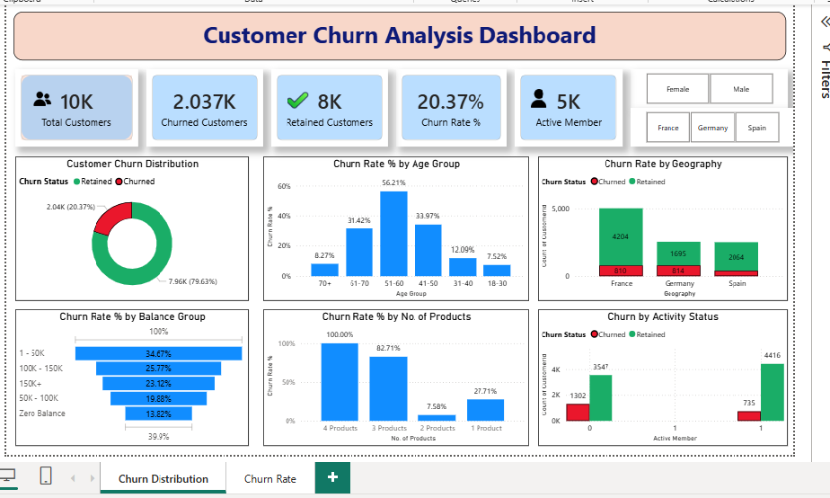
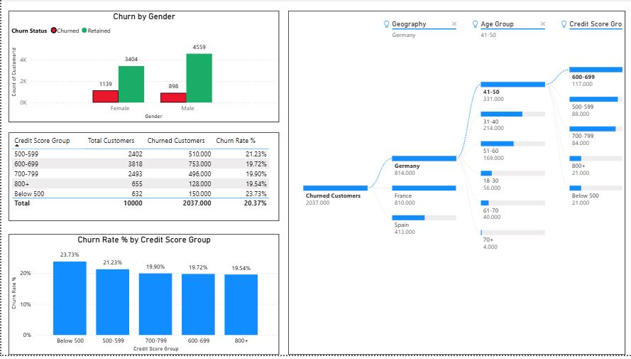

# 📊 Customer Churn Analysis Dashboard using Power BI

## 📌 Project Overview

Customer retention is one of the most important business objectives in the banking industry. This project analyzes customer churn using Power BI to identify the factors influencing customer attrition and provide actionable insights that can help improve customer retention strategies.

The dashboard enables stakeholders to monitor churn trends, compare customer segments, and identify high-risk customers through interactive visualizations.

---
## 🎯 Business Objective

The primary objectives of this project are to:

- Analyze customer churn trends.
- Identify the factors contributing to customer churn.
- Measure churn across customer demographics.
- Provide actionable insights to improve customer retention.
- Build an interactive dashboard for business decision-making.

---

## 📂 Dataset Information

The dataset contains **10,000 customer records** with the following attributes:

- Customer ID
- Credit Score
- Geography
- Gender
- Age
- Tenure
- Balance
- Number of Products
- Has Credit Card
- Active Member Status
- Estimated Salary
- Exited (Churn Status)

---

## 🛠 Tools & Technologies

- Power BI Desktop
- Power Query
- DAX (Data Analysis Expressions)
- Microsoft Excel
- Git & GitHub

---
## 🧹 Data Cleaning & Preparation

The following preprocessing steps were performed:

- Removed duplicate customer records.
- Verified missing values.
- Corrected data types.
- Created Age Group column.
- Created Credit Score Group and Balance Group.
- Built calculated columns and DAX measures.
- Validated data quality before visualization.

---
## 📈 DAX Measures Created

- Total Customers
- Churned Customers
- Retained Customers
- Churn Rate %
- Active Members

---
# 📊 Dashboard 1 – Customer Churn Overview

### KPI Cards

- 👥 Total Customers: **10,000**
- ❌ Churned Customers: **2,037**
- ✅ Retained Customers: **7,963**
- 📉 Churn Rate: **20.37%**
- 👤 Active Members: **5,000**

---

### Visualizations

- Customer Churn Distribution
- Churn Rate by Age Group
- Churn Rate by Geography
- Churn Rate by Balance Group
- Churn Rate by Number of Products
- Churn by Activity Status
- Interactive Filters (Slicers)

---
# 📊 Dashboard 2 – Customer Segmentation Analysis

### Visualizations

- Churn by Gender
- Churn Rate by Credit Score Group
- Credit Score Summary Table
- Decomposition Tree Analysis

### Decomposition Tree Analysis

The decomposition tree allows users to drill down churned customers based on:

- Geography
- Age Group
- Credit Score Group

This helps identify the combination of factors contributing most to customer churn.

---

## Key Business Insights

- Customers aged **51–60** showed a higher churn rate.
- Inactive members were significantly more likely to churn than active members.
- Geography influenced customer churn behavior.
- Customers with fewer products tended to churn more frequently.
- Credit score and account balance also showed relationships with churn.

---

## 💼 Business Recommendations

- Increase engagement with inactive customers.
- Design personalized retention campaigns for high-risk customer groups.
- Promote additional banking products to improve customer loyalty.
- Focus retention strategies on regions with higher churn.
- Monitor customers showing early signs of disengagement.

---

# 📷 Dashboard Preview

## Dashboard 1



## Dashboard 2



---

## Repository Structure

```
Customer-Churn-Analysis-Power-BI
│
├── Customer_Churn_Project.pbix
├── Churn_Modelling.csv.xls
├── Customer_Churn_Project.pdf
├── Dashboard_1.png
├── Dashboard_2.png
└── README.md
```

---

## Skills Demonstrated

- Data Cleaning
- Data Transformation
- Exploratory Data Analysis (EDA)
- Data Visualization
- DAX Calculations
- Business Intelligence
- Dashboard Design
- Business Insight Generation

---

## Project Outcome

This project demonstrates the end-to-end workflow of a data analyst—from data preparation and analysis to dashboard creation and business recommendations using Power BI.


